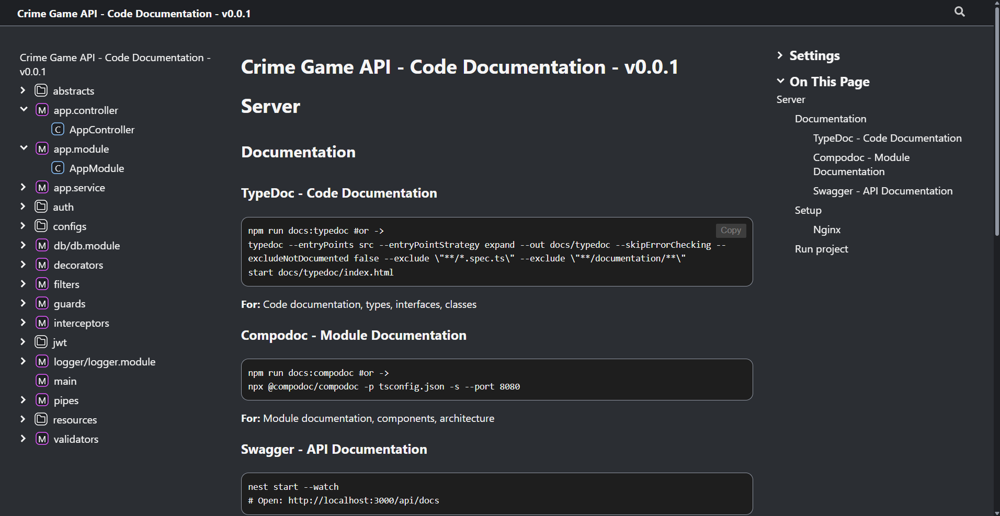
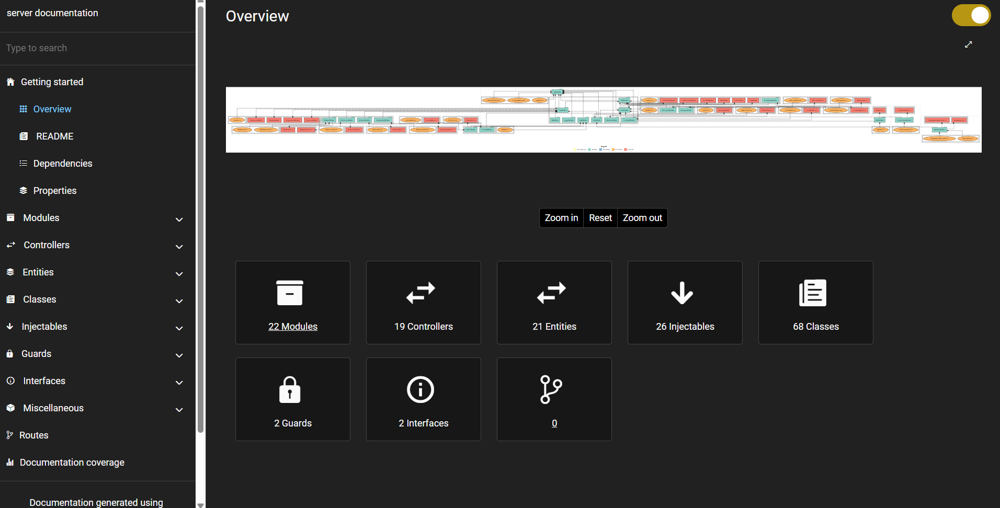
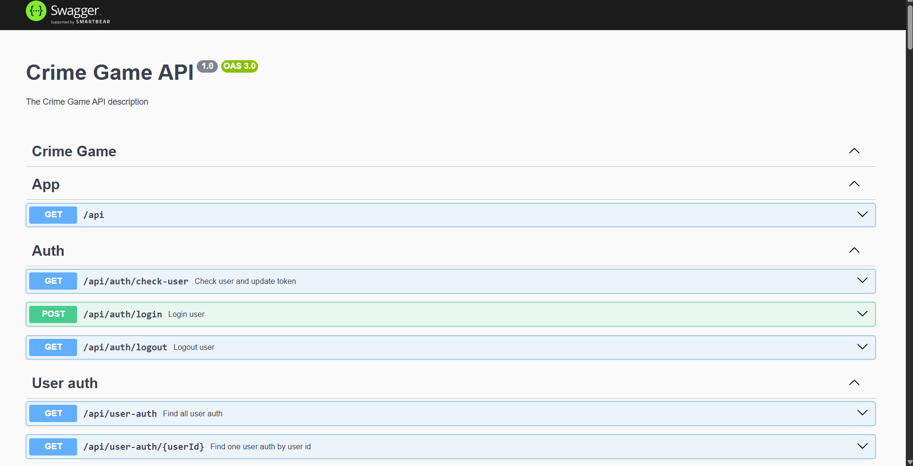

# Server

## Documentation

### TypeDoc - Code Documentation
```powershell
npm run docs:typedoc #or ->
typedoc --entryPoints src --entryPointStrategy expand --out docs/typedoc --skipErrorChecking --excludeNotDocumented false --exclude \"**/*.spec.ts\" --exclude \"**/documentation/**\"
start docs/typedoc/index.html
```
**For:** Code documentation, types, interfaces, classes


### Compodoc - Module Documentation  
```powershell
npm run docs:compodoc #or ->
npx @compodoc/compodoc -p tsconfig.json -s --port 8080
```
**For:** Module documentation, components, architecture


### Swagger - API Documentation
```powershell
nest start --watch #or use bun ->
bun run start:dev
# Open: http://localhost:3000/docs#/
```
**For:** API documentation, endpoints, DTOs, testing



## Deployment
### Nginx
```nginx
# Rate limiting (optional)
limit_req_zone $binary_remote_addr zone=api:10m rate=10r/s;

server {
    server_name your-domain.com www.your-domain.com;
    listen 443 ssl;
    
    # SSL certificates
    ssl_certificate "/path/to/your/certificate.crt";
    ssl_certificate_key "/path/to/your/private.key";
    
    # Gzip compression for better performance
    gzip on;
    gzip_proxied expired no-cache no-store private auth;
    gzip_types text/css text/xml application/javascript text/plain application/json image/svg+xml image/x-icon;
    gzip_comp_level 1;
    
    # Angular build output directory
    root /var/www/your-app/dist/www/browser;
    
    # API proxy to backend
    location /api {
        limit_req zone=api burst=20 nodelay;
        proxy_pass http://127.0.0.1:3000;
        proxy_redirect http://127.0.0.1:3000/ /;
        proxy_set_header Host $host;
        proxy_set_header X-Real-IP $remote_addr;
        proxy_set_header X-Forwarded-For $proxy_add_x_forwarded_for;
        proxy_set_header X-Forwarded-Proto $scheme;
    }
    
    # SPA routing - serve index.html for all routes
    location / {
        try_files $uri $uri/ /index.html;
    }
    
    # Static assets with long cache headers
    location ~* ^.+\.(jpg|jpeg|gif|png|svg|js|css|mp3|ogg|mpeg|avi|zip|gz|bz2|rar|swf|ico|7z|doc|docx|map|ogg|otf|pdf|tff|tif|txt|wav|webp|woff|woff2|xls|xlsx|xml)$ {
        expires 1y;
        add_header Cache-Control "public, immutable";
        try_files $uri $uri/ @fallback;
    }
    
    # Fallback for missing static files
    location @fallback {
        proxy_pass http://127.0.0.1:3000;
        proxy_redirect http://127.0.0.1:3000/ /;
        include /etc/nginx/proxy_params;
    }
}

# HTTP to HTTPS redirect
server {
    server_name your-domain.com www.your-domain.com;
    listen 80;
    return 301 https://$host$request_uri;
}
```

### Run project
- Run command - ```npm install -g @nestjs/cli``` or ```bun install -g @nestjs/cli```
- Install PM2 - ```npm install pm2 -g``` or ```bun install -g pm2```
- Clone project
- Setting up the [.env](./.env.example)
- Install all packages - ```pnpm i``` or ```bun install```
- Build project and get 'dist' path - ```nest build``` or ```bun run build```
- If use bun upload to server ```ecosystem.config.js``` (if want use v2)
- Check run project - ```node dist/main.js```
- Correct? Run command - 
```powershell
pm2 start dist/main.js --name {name?} # name for process
pm2 start --interpreter ~/.bun/bin/bun dist/main.js --name {name?} #v1 with bun
pm2 start ecosystem.config.js #v2 with bun
```

## Tech Stack
- **Backend:** NestJS, TypeScript, TypeORM
- **Database:** MySQL, SQLite
- **Documentation:** TypeDoc, Compodoc, Swagger
- **Package Manager:** pnpm
- **Process Manager:** PM2

### Core Modules
- **`auth/`** - Authentication & authorization (JWT, guards, decorators)
- **`db/`** - Database configuration and connection
- **`jwt/`** - JWT token management and blacklist

### Resources
- **`world/`** - World management
- **`user/`** - User management (profile, auth, stats, economy, settings, ...)
- **`clan/`** - Clan system (members, permissions, requirements, ...)
- **`city/`** - City management and ownership (buildings)
- **`materials/`** - Game materials and resources
- **`chat/`** - Chat management system (chat, participants, messages) 
- **`locations/bank/`** - Bank system (bank items, catalog, vaults(...), trading(...), ...)

### Module Architecture

### Application Configuration & Infrastructure

#### Global Middleware & Security
- **Helmet** - Security headers (CSP, CORS policies)
- **Compression** - Response compression (level 6, threshold 1024 bytes)
- **CORS** - Cross-origin resource sharing (credentials enabled, maxAge 86400)
- **Cookie Parser** - Cookie handling for authentication
- **Throttler** - Rate limiting (default: 15 requests per 60 seconds, configurable via env)

#### Validation & Serialization
- **ValidationPipe** - Global validation with custom error handling (422 status code)
  - Whitelist mode (removes unknown properties)
  - Transform mode (auto-transforms DTOs)
  - Detailed error logging and formatting
- **ClassSerializerInterceptor** - Automatic serialization of responses

#### Logging
- **Winston Logger** - Structured logging system
- **LoggingInterceptor** - Request/response logging
- **Custom Log Decorator** - `@Log()` for method-level logging

#### WebSocket Support
- **Chat Gateway** - Real-time chat communication
- **Bank Gateway** - Real-time bank updates and notifications

#### Scheduled Tasks (Cron Jobs)
- **Database Backup** - Daily at 3 AM (MariaDB + SQLite), weekly cleanup
- **Profile Activity** - Daily at midnight (decreases activity by 3)
- **Market Cleanup** - Daily at midnight
- **Vaults Processing** - Daily at midnight
- **Files Cleanup** - Weekly (weekends)
- **JWT Blacklist Cleanup** - Every 3 days

#### Static Files
- **ServeStaticModule** - Serves files from `/public` directory at `/static` endpoint
- Cache headers for static assets (1 year)
- Special caching for catalog endpoints (1 hour)

#### Database Services
- **BackupService** - Automated database backups (MariaDB & SQLite)
- **FunctionsService** - Dynamic SQL function generation for catalog queries
  - Generates `get_catalog_item_*` functions based on database schema
  - Supports multiple catalog types and field types

### Architectural Patterns

#### Base CRUD Service
- **DefaultCRUDService** - Abstract base class for all entity services
  - Standard CRUD operations (create, read, update, delete)
  - Advanced search with LIKE queries and array filtering
  - Pagination support
  - Relation loading
  - Transaction support via EntityManager
  - Bulk operations (createBulk, updateBulk, removeBulk)

#### Database Transactions
- All critical operations use `EntityManager.transaction()`
- Ensures data consistency across multiple operations
- Example: Trading creation, item selling, exchange operations

#### Virtual Columns (TypeORM)
- **VirtualColumn** decorator for computed database fields
- Uses SQL functions for catalog lookups
- Example: `nameKey`, `basePrice`, `category` computed from catalog tables

#### Custom Decorators
- **`@Log()`** - Method-level logging
- **`@Public()`** - Bypass authentication for specific routes
- **`@GetUser()`** - Extract user from request
- **`@ParamDto()`** - Transform and validate route parameters
- **`@QueryDto()`** - Transform and validate query parameters
- **`@ControlPurchase()`** - Purchase control decorator

#### Guards
- **AuthGuard** - Global authentication guard (JWT validation)
- **PurchaseGuard** - Global purchase validation guard
- Both applied globally via `APP_GUARD` provider

#### Interceptors
- **LoggingInterceptor** - Global request/response logging
- **PurchaseInterceptor** - Purchase operation interception
- **FileCleanerInterceptor** - Automatic file cleanup after operations

#### Exception Filters
- **GlobalErrorsFilter** - Global error handling and formatting
- **DBQueryFilter** - Database query error handling
- **MulterFilter** - File upload error handling
- **ThrottlerLogFilter** - Rate limiting error logging

#### Custom Validators
- **`@PasswordStrength()`** - Password strength validation
- **`@DtoMatch()`** - DTO field matching validation

#### Custom Pipes
- **UniParamsPipe** - Unified parameter transformation
- **UniUrlDtoPipe** - URL DTO transformation

#### Multiple Database Support
- **Primary Database** - MySQL/MariaDB (main application data)
- **Secondary Database** - SQLite (JWT blacklist, lightweight data)
- Database selection via TypeORM connection names

#### Entity Management

**All entities must be registered in centralized barrel files for proper module resolution and to avoid circular dependencies.**

**Rules:**
- **Main entities** (MariaDB) → Register in `src/entities.ts`
- **Lite entities** (SQLite) → Register in `src/entities-lite.ts`
- **Import entities** in other files using aliases: `@entities` or `@entities-lite`
- **Never import entities directly** from their source files when using them in other entities or services

**Example:**
```ts
// src/entities.ts - Register all main entities
export * from './resources/user/user/entities/user.entity';
export * from './resources/clan/clan/entities/clan.entity';
// ... other entities

// src/entities-lite.ts - Register all lite entities
export * from './jwt/entities/tokenBlacklist.entity.lite';

// src/resources/user/user/entities/user.entity.ts - Import from barrel file
import { Clan, UserProfile } from '@entities'; // ✅ Correct


import { Clan } from '../../clan/clan/entities/clan.entity'; // ❌ Wrong: 
```
```ts
// src/db/db.module.ts - Use barrel files for TypeORM configuration
import * as entities from '@entities';
import * as entitiesLite from '@entities-lite';

// Use in TypeORM config
entities: [...Object.values(entities)],
entities: [...Object.values(entitiesLite)], // for SQLite
```
**Benefits:**
- ✅ Resolves circular dependencies through centralized loading
- ✅ Consistent import pattern across the codebase
- ✅ Works correctly with SWC compiler
- ✅ Easier to manage and maintain entity registry

#### Resource Organization Principles
**1. Semantically Similar Resources → Shared Folder**

Resources that are logically related and belong to the same domain should be organized in a shared folder and can import each other through modules.

**Example:**
```
bank/
    ├── bank/ # Main bank entity
    ├── items/ # Bank items (imports bank/)
    ├── maintenance/ # Item repair (imports items/)
    └── vaults/ # Bank vaults (imports bank/)
market/
    └── market-bank/ # Entity for trading bank items
```
**2. Cross-Module Dependencies Within Same Domain → Use `forwardRef`**

When modules within the same semantic domain need to reference each other (parent-child relationship or bidirectional dependency), use `forwardRef()` to handle circular dependencies.

**Rules:**
- Use `forwardRef()` in module imports when modules reference each other
- Parent module exports services that child modules need
- Child module can access parent's services through exports
- No need for `forwardRef` in service constructors if there's no direct circular dependency between services

**Example:**
```ts
// bank.module.ts - Parent module
@Module({
  imports: [
    TypeOrmModule.forFeature([Bank]),
    ItemsModule,
    forwardRef(() => TradingModule), // Child module that needs parent
  ],
  exports: [
    BankService,      // Export for child modules
    ItemsModule,      // Export nested modules
  ],
})
export class BankModule {}
```
```ts
// trading/trading.module.ts - Child module
@Module({
  imports: [
    TypeOrmModule.forFeature([BankTrading]),
    OffersModule,
    WishlistModule,
    forwardRef(() => BankModule), // Access parent module
  ],
  exports: [TradingService],
})
export class TradingModule {}
```
```ts
// trading/trading.service.ts - Uses parent services
@Injectable()
export class TradingService {
  constructor(
    private bankService: BankService,    // ✅ No forwardRef needed - one-way dependency
    private itemsService: ItemsService,  // ✅ Available through BankModule exports
  ) {}
}
```
**When to use `forwardRef` in services:**
- Only if services have **direct circular dependency** (ServiceA → ServiceB → ServiceA)
- Not needed for one-way dependencies (ChildService → ParentService)

**3. Semantically Different Resources → Direct Entity Usage Only**

Resources from different domains that interact should **always** use entities directly through `TypeOrmModule.forFeature()`, **never** import each other's modules. This ensures consistency and prevents confusion about when to use entities vs modules.

**Rules:**
- Use only the entity repository, never import the other module
- Limit interaction to minimal operations (e.g., only creation or updates)
- All business logic should remain in its own module

**Example:**
```ts
// bank.module.ts - Bank (finance domain)
@Module({
  imports: [
    TypeOrmModule.forFeature([Bank, MarketBankItem]), // Only entity
    // MarketBankModule NOT imported!
  ],
})
export class BankModule {}


// bank.service.ts - Only creates listing
async sellItemToMarket(...) {
  // Minimal logic: validation + create record
  await this.marketBankRep.save(listing);
}
```

```ts
// market-bank.module.ts - Market (trading domain)
@Module({
  imports: [
    TypeOrmModule.forFeature([MarketBankItem, Bank, BankItem]), // Only entities
    // BankModule NOT imported!
  ],
})
export class MarketBankModule {}


// market-bank.service.ts - Updates bank balance directly
async purchaseItem(...) {
  // Updates bank balance using Bank repository directly
  await this.bankRep.increment({ userId: sellerId }, 'balance', amount);
}
async returnItemToBank(...) {
  // Returns item using BankItem repository directly
  await this.bankItemRep.increment({ id: bankItemId }, 'quantity', quantity);
}
```

**Benefits:**
- ✅ No circular dependencies
- ✅ Consistent pattern - always use entities for cross-domain interaction
- ✅ Clear separation of concerns
- ✅ Minimal coupling between modules
- ✅ Easy to test and maintain

### Shared
- **`abstracts/`** - Base classes (DefaultCRUD, DefaultLogMsg)
- **`decorators/`** - Custom decorators (auth, logging, file handling)
- **`filters/`** - Global exception filters
- **`guards/`** - Route guards (auth, purchase)
- **`interceptors/`** - Request/response interceptors
- **`pipes/`** - Data transformation pipes
- **`validators/`** - Custom validation rules